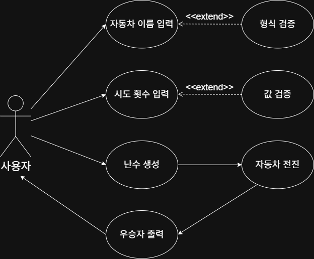

# 프리코스 2주차 - 자동차 경주
## 1. 프로젝트 개요
> 난수에 따라 전진하는 자동차 경주 게임 구현
## 2. 기능 목록
### 1. 자동차 이름 입력
- [ ] 올바른 형식인지 검증
- [ ] 쉼표를 기준으로 문자열 분할
### 2. 시도할 횟수(n) 입력
- [ ] 숫자인지 검증
### 3. 난수 생성
- [ ] 0에서 9까지의 난수 생성
- [ ] 4 이상이면 true 반환
### 4. 자동차 전진
- [ ] 난수 생성 결과가 true이면 자동차 전진
### 5. 우승자 출력
- [ ] n번 전진한 자동차 객체 출력
- [ ] n번 전진한 자동차가 없으면 가장 많이 전진한 자동차 출력
- [ ] 우승자는 모두 출력하되, 쉼표를 이용해 구분

## 3. Use Case Diagram
위의 기능 목록에 대한 use case diagram이다.

## 4. 시스템 구조
### Model

| 클래스명 | 역할 |
|-----------|------|
| `Car` | 이름과 이동거리 저장 |
| `GetRandomNumber` | 0~9 사이의 난수를 생성 |
| `MoveForward` | 난수(4 이상) 여부에 따라 자동차 전진 여부 결정 |
| `CarNameValidator` | 자동차 이름의 유효성 검사 (빈 문자열, 길이 등) |
| `CarNameParser` | 입력받은 자동차 이름 문자열을 쉼표로 분리 |
| `LapValidator` | 시도 횟수(n)의 유효성 검사 |
| `GetWinner` | 우승자 판별 |

---

### View

| 클래스명 | 역할 |
|-----------|------|
| `InputView` | 자동차 이름 및 시도 횟수 입력 |
| `OutputView` | 경주 진행 결과와 우승자 출력 |

---

### Controller

| 클래스명 | 역할 |
|-----------|------|
| `RacingController` | 사용자 입력 → 검증 → 경주 실행 → 결과 출력까지 전체 흐름 제어 |

---